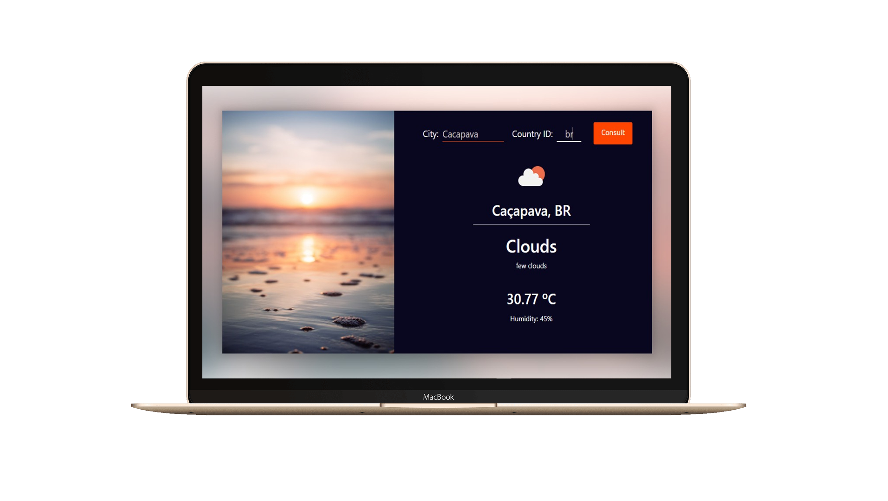

<h1 align="center">
    
</h1>

<h4 align="center">
    ⛅️ Weather Forecast 🌈   
</h4>

  <a href="#rocket-tecnologias">Tecnologias</a>&nbsp;&nbsp;&nbsp;|&nbsp;&nbsp;&nbsp;
  <a href="#-projeto">Projeto</a>&nbsp;&nbsp;&nbsp;|&nbsp;&nbsp;&nbsp;
  <a href="#-principais-conceitos-abordados">Conceitos</a>&nbsp;&nbsp;&nbsp;|&nbsp;&nbsp;&nbsp;
  <a href="#-configuração-do-projeto">Configurações</a>&nbsp;&nbsp;&nbsp;|&nbsp;&nbsp;&nbsp;

 

  

## :rocket: Tecnologias

- [React](https://reactjs.org)
- [Axios](https://www.npmjs.com/package/axios)
- [Open Weather API](https://openweathermap.org/current)

## 💻 Projeto

- Aplicação para consulta de previsão de tempo e clima em cidades, estados ou países específicos.

## 📚 Principais conceitos abordados

- Consumir um API
- Busca pelas rotas
- useState 
- Responsividade

## 🤔 Configuração do projeto

- Clone o repositório
- Instale as <a href="#bookmark_tabs-possíveis-dependências-ou-frameworks">dependências</a> necessárias
- Execute 'npm start' ou 'yarn start' no terminal
- Ou clique no link abaixo se deseja apenas visualizar a aplicação :smile:
  
:point_down:**Link da aplicação hospedada no Firebase** :point_down:

 [Weather App](https://weatherapp-559f6.firebaseapp.com/)

<h1></h1>

## :bookmark_tabs: Possíveis dependências ou frameworks

- [Axios](https://www.npmjs.com/package/axios) ( *npm install axios / yarn add axios* )

- [React router dom](https://reacttraining.com/react-router/web/guides/quick-start) ( *npm install react-router-dom / yarn add react-router-dom* )

- [React icons](https://react-icons.netlify.com/#/) ( *npm install react-icons --save / yarn add react-icons* )

- [React Bootstrap](https://react-bootstrap.github.io/getting-started/introduction/) ( *npm install react-bootstrap bootstrap / yarn add react-bootstrap bootstrap* )
